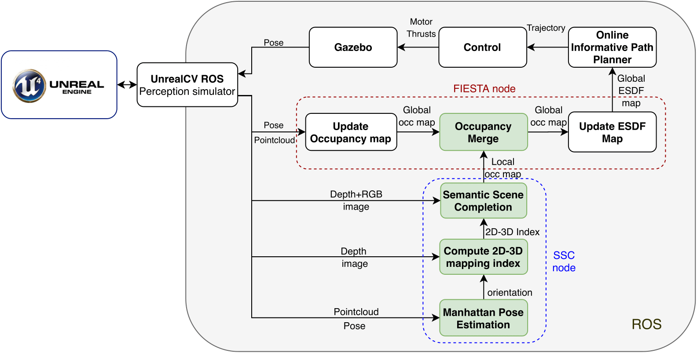

# ssc_exploration

**ssc_exploration** aims at augmenting robotic exploration thanks to the use of semantic scene completion. We provide here a ROS package with a ssc node, predicting scene occupancy from the current point of view. This package integrate itself into a exploration pipeline developped in collaboration with the autonomous systems lab of ETHZ:https://github.com/ethz-asl/mav_active_3d_planning.git. The semantic scene completion itself is based on this repository: https://github.com/waterljwant/SSC. 

In order to integrate the predictions of SSC to the SSC pipeline, modifications to FIESTA, unreal_cv_ros and mav_active_3d_planning were necessary:
https://github.com/arnovaill/mav_active_3d_planning
https://github.com/arnovaill/unreal_cv_ros
https://github.com/arnovaill/FIESTA

## Architecture



## Dependencies
It is strongly recommended to use a conda environment to use this repository. The environment used to compile and run the code is provided [here](environment.yml).

## Setup
First, setup a catkin workspace using the modified version of mav_active_3d_planning based on FIESTA, following the instructions here: https://github.com/arnovaill/mav_active_3d_planning. 

The semantic scene completion is based on Python 3. As ROS melodic only supports Python 2.7, a separate catkin workspace based on Python 3.6 needs to be built using the following instruction: 

```bat
mkdir -p ssc_ws/src
cd ssc_ws/src
git clone --recurse-submodules https://github.com/arnovaill/ssc_exploration.git
git clone https://github.com/eric-wieser/ros_numpy.git
cd ..

wstool init
wstool set -y src/geometry2 --git https://github.com/ros/geometry2 -v 0.6.5
wstool up
rosdep install --from-paths src --ignore-src -y -r

catkin build --cmake-args -DCMAKE_BUILD_TYPE=Release -DPYTHON_EXECUTABLE='/home/arno/anaconda3/envs/ssc/bin/python3.6' -DPYTHON_INCLUDE_DIR='/home/arno/anaconda3/envs/ssc/include/python3.6m' -DPYTHON_LIBRARY='/home/arno/anaconda3/envs/ssc/lib/libpython3.6m.so'


```

## Configuration
Before any experiment, the field of view must be set corresponding to the field of view of the SSC model. In the installation folder of UnrealEngine change the field of view in /UnrealEngine/Engine/Binaries/Linux/unrealcv.ini to **50.9678**. The starting height of the drone must be changed before use, it is currently hard-coded in the ssc.py file. 


## Run an Experiment
In the exploration workspace, run: 
```bat
roslaunch active_3d_planning_app_reconstruction example_fiesta.launch
```

In the SSC workspace, run: 

```bat
rosrun ssc ssc.py
```
